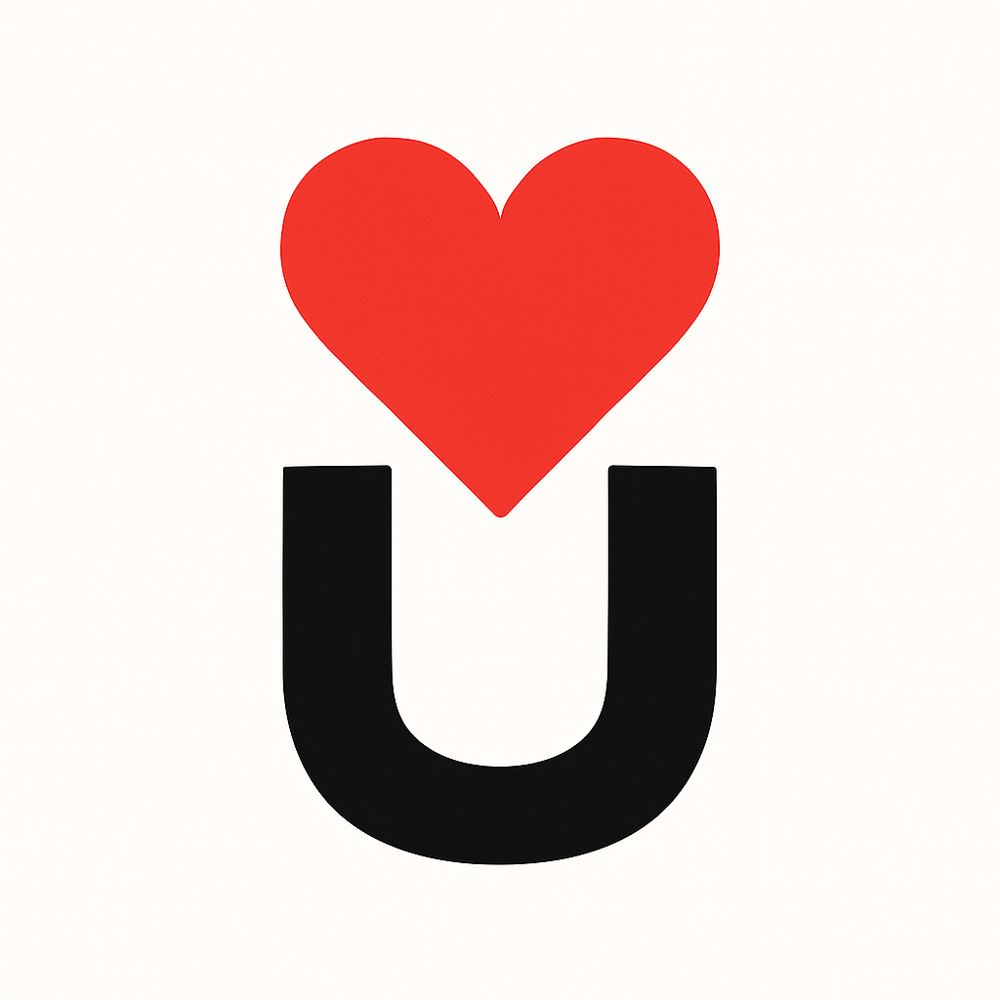

<p align="center">
  
</p>

<h1 align="center">❤ U Festival 2026</h1>

<p align="center">
  <strong>Progressive Web App — Strijkviertel, Utrecht</strong><br/>
  <em>5 & 6 september 2026</em>
</p>

<p align="center">
  
  
  
  
  
</p>

<p align="center">
  <a href="https://u-festival-app.onrender.com">🌐 Live Demo</a> ·
  <a href="https://u-festival-app.onrender.com/admin.html">🔐 Admin CMS</a> ·
  <a href="#-snel-starten">🚀 Snel starten</a> ·
  <a href="setup.md">📖 Volledige setup-gids</a>
</p>

---

## 📋 Over dit project

Een interactieve en offline-beschikbare **Progressive Web App (PWA)** voor het fictieve **U Festival 2026** op het Strijkviertel in Utrecht. Gebouwd als moderne, mobiel-vriendelijke festivalgids waarmee bezoekers ter plekke alle praktische en programma-informatie direct bij de hand hebben.

De app is volledig **client-side** gebouwd — geen build-stappen, geen npm-installatie, geen frameworks — met een sterke focus op performance, vloeiende UX en native-achtige mobiele functionaliteit.

> 💡 **Schoolproject** — Ontwikkeld voor module 8.1 aan het GLU (Games & Interaction).

---

## ✨ Functionaliteiten

### 🎵 Programma & Line-up
- Volledig overzicht van alle artiesten, gesorteerd per festivaldag en podium
- Uitgebreide detailpagina's per act met biografieën, genre-tags en geïntegreerde YouTube-trailers
- Interactief blokkenschema met horizontaal scrollbare grid

### ⭐ Persoonlijk Schema (Favorieten)
- Markeer je favoriete artiesten om een persoonlijk schema samen te stellen
- Opgeslagen in `localStorage` — werkt volledig offline

### 🗺️ Interactieve Plattegrond
- Vectorgebaseerde (SVG) kaart van het festivalterrein met klikbare hotspots
- Live GPS-locatie van de bezoeker op de kaart
- Legenda met alle podia en faciliteiten

### 📱 Progressive Web App
- **Offline modus** — Service Worker cachet alle pagina's, data en afbeeldingen
- **Installeerbaar** — Toevoegen aan startscherm op iOS en Android
- **Push notificaties** — Ondersteuning voor meldingen via de Service Worker

### 🎨 UI & Toegankelijkheid
- **Light & Dark mode** — Dynamisch schakelen met CSS Custom Properties
- **Meertalig** — Direct schakelen tussen Nederlands 🇳🇱 en Engels 🇬🇧
- **QR-code scanner** — Ingebouwde camera-scanner voor interactie op het terrein
- **Responsive design** — Optimaal op elk schermformaat

### 🔐 Admin CMS
- Beveiligd contentbeheersysteem (`admin.html`)
- Beheer artiesten, schema, nieuws en app-instellingen
- Live preview van wijzigingen

---

## 🎶 Line-up & Artiesten

### 🎤 Zaterdag 5 september — Pôton (Hoofdpodium)

| Tijd | Artiest | Genre | Clip |
| :--- | :--- | :--- | :--- |
| 10:30 – 11:45 | **Armin van Buuren** | Trance | [▶ YouTube](https://www.youtube.com/watch?v=TxvpctgU_s8) |
| 12:30 – 13:45 | **Kensington** | Indie Rock | [▶ YouTube](https://www.youtube.com/watch?v=IH77eOyV95o) |
| 14:30 – 16:15 | **De Staat** | Experimental Rock | [▶ YouTube](https://www.youtube.com/watch?v=0ttGgIQpAUc) |
| 17:00 – 18:15 | **Navarone** | Rock | [▶ YouTube](https://www.youtube.com/watch?v=EvLpaCSnc4k) |
| 19:15 – 21:00 | **Dotan** | Folk-Pop | [▶ YouTube](https://www.youtube.com/watch?v=FZEuqzW16Nw) |
| 22:00 – 23:45 | **Froukje** | Pop | [▶ YouTube](https://www.youtube.com/watch?v=g4PlReX9e-E) |

### 🎤 Zondag 6 september — Pôton (Hoofdpodium)

| Tijd | Artiest | Genre | Clip |
| :--- | :--- | :--- | :--- |
| 11:00 – 12:45 | **Martin Garrix** | EDM | [▶ YouTube](https://www.youtube.com/watch?v=Zv1QV6lrc_Y) |
| 13:45 – 15:30 | **Within Temptation** | Symphonic Metal | [▶ YouTube](https://www.youtube.com/watch?v=iQVei5C2N4E) |
| 16:30 – 18:15 | **Chef'Special** | Funk-Pop | [▶ YouTube](https://www.youtube.com/watch?v=l3jRIr44lss) |
| 19:15 – 21:00 | **Eefje de Visser** | Indie-Pop | [▶ YouTube](https://www.youtube.com/watch?v=6IlLJNmLDMg) |
| 22:00 – 23:45 | **Spinvis** | Lo-Fi Pop | [▶ YouTube](https://www.youtube.com/watch?v=F3ZTrGWSLf4) |

### 🎪 Overige Podia

| Podium | Programma |
| :--- | :--- |
| **The Lake** | Talent Showcases — Lokale artiesten doorlopend van 10:00–22:45 |
| **The Club** | Comedy, Lectures, Theater, Film & Illusieshow |
| **Hangar** | Non-stop DJ sets — House, Techno & Dance van 10:00–23:45 |

---

## 🧰 Technische Stack

| Categorie | Technologie |
| :--- | :--- |
| **Structuur** | Semantische HTML5 |
| **Styling** | CSS3 met Custom Properties, Flexbox & Grid |
| **Logica** | Vanilla JavaScript (ES6+) |
| **Typografie** | [Sansation](https://fonts.google.com/specimen/Sansation) via Google Fonts |
| **CMS typografie** | [Inter](https://fonts.google.com/specimen/Inter) via Google Fonts |
| **PWA** | Service Worker API + Web App Manifest |
| **QR-scanner** | [qrcode.min.js](js/qrcode.min.js) + Camera API |
| **Kaart** | Custom SVG plattegrond + Geolocation API |
| **Hosting** | [Render.com](https://render.com/) — Static Site |
| **Versiebeheer** | Git + GitHub |

---

## 📁 Projectstructuur

```text
8.1---Module---U-Festival-App/
├── assets/                  # Alle visuele bestanden
│   ├── artists/             # Foto's van de optredende artiesten
│   ├── icons/               # PWA-iconen en UI-iconen (logo's)
│   ├── images/              # Overige afbeeldingen
│   ├── map/                 # SVG-kaartbestanden en stage previews
│   ├── qr/                  # QR-code gerelateerde assets
│   └── schema/              # Schema-gerelateerde afbeeldingen
├── data/                    # Gestructureerde data en vertalingen
│   ├── acts.json            # Artiesteninformatie, bio's en video-links
│   ├── i18n.js              # Vertalingen NL/EN (meertaligheid)
│   ├── map-markers.json     # Coördinaten en details voor kaartpunten
│   ├── map-markers.js       # Kaartmarker logica
│   ├── news.json            # Nieuwsberichten voor de homepagina
│   ├── schedule.json        # Volledig blokkenschema per dag/podium
│   └── schedule.proposed.json # Voorgesteld schema (concept)
├── js/                      # JavaScript-modules
│   ├── qr.js                # QR-code scanner logica
│   └── qrcode.min.js        # QR-code generatiebibliotheek
├── Documents/               # Projectdocumentatie
│   └── Pwa vragen_onderzoek.pdf
├── index.html               # 🏠 Hoofdpagina — de festival-app
├── admin.html               # 🔐 Admin CMS dashboard
├── manifest.json            # PWA configuratie (thema, iconen, scope)
├── service-worker.js        # Caching & offline-afhandeling
├── render.yaml              # Render.com Static Site Blueprint
├── setup.md                 # 📖 Uitgebreide setup-handleiding
└── .gitignore               # Git ignore-regels
```

---

## 🚀 Snel starten

> Voor een **uitgebreide handleiding** met alle opties en troubleshooting, zie [`setup.md`](setup.md).

### 1. Clone de repository

```bash
git clone https://github.com/LarsM04/8.1---Module---U-Festival-App.git
cd 8.1---Module---U-Festival-App
```

### 2. Start een lokale server

De app gebruikt `fetch()` om JSON-data in te laden — een lokale webserver is daarom vereist.

**VS Code Live Server (aanbevolen):**
1. Installeer de [Live Server](https://marketplace.visualstudio.com/items?itemName=ritwickdey.LiveServer) extensie
2. Klik op **Go Live** rechtsonder in VS Code
3. De app opent op `http://localhost:5502`

**Alternatief — Node.js:**
```bash
npx serve .
```

**Alternatief — Python:**
```bash
python -m http.server 8000
```

### 3. Open de app

| Pagina | URL |
| :--- | :--- |
| Festival-app | `http://localhost:5502` |
| Admin CMS | `http://localhost:5502/admin.html` |

---

## 🌐 Live Demo

De app is gedeployed op **Render.com** en is online beschikbaar:

| | Link |
| :--- | :--- |
| 🌐 **Live app** | [u-festival-app.onrender.com](https://u-festival-app.onrender.com) |
| 🔐 **Admin CMS** | [u-festival-app.onrender.com/admin.html](https://u-festival-app.onrender.com/admin.html) |
| 📦 **GitHub repo** | [github.com/LarsM04/8.1---Module---U-Festival-App](https://github.com/LarsM04/8.1---Module---U-Festival-App) |

> Bij elke push naar de `main` branch wordt de site automatisch opnieuw gebouwd en gedeployed via de meegeleverde `render.yaml` configuratie.

---

## 🔗 Externe bronnen & links

| Bron | Link |
| :--- | :--- |
| Google Fonts — Sansation | [fonts.google.com/specimen/Sansation](https://fonts.google.com/specimen/Sansation) |
| Google Fonts — Inter | [fonts.google.com/specimen/Inter](https://fonts.google.com/specimen/Inter) |
| Render.com — Hosting | [render.com](https://render.com/) |
| VS Code Live Server extensie | [marketplace.visualstudio.com](https://marketplace.visualstudio.com/items?itemName=ritwickdey.LiveServer) |
| 9292 Reisplanner (OV) | [9292.nl](https://9292.nl/) |

---

## 📄 Licentie

Dit project is ontwikkeld als schoolopdracht voor het GLU (Games & Interaction) en is bedoeld voor educatieve doeleinden.

---

<p align="center">
  Gemaakt met ❤ voor het <strong>U Festival 2026</strong>
</p>
